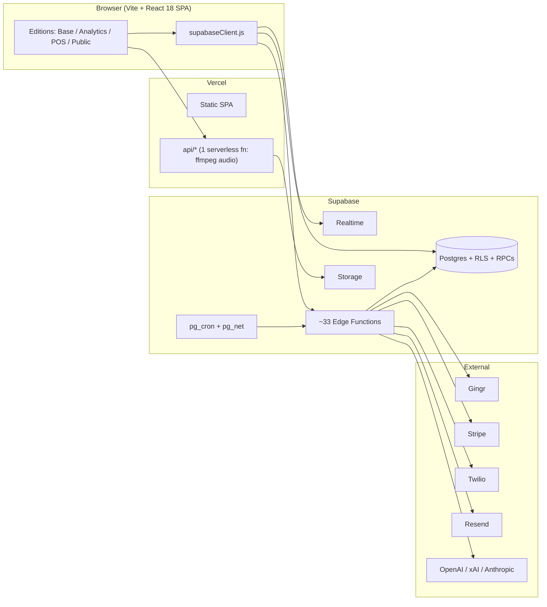

# K9 Operations — Architecture

> The master architecture overview. It explains what the product is, the three
> application editions it ships as, the full‑stack shape, and the reorganized
> file structure. Deep‑dive documents are linked throughout.

**Audience:** engineers (internal and prospective open‑source contributors).
**Status:** living document. Reflects the in‑flight reorganization (see
[§6](#6-reorganization-status)).

---

## 1. What K9 Operations is

K9 Operations is the **operating system for pet‑care facilities** (boarding &
daycare resorts). It sits on top of a facility's existing PMS (**Gingr**) and
turns that raw booking data into:

- a **daily‑operations** layer (checklists, roll calls, feeding/meds, room
  cleaning, bathing, resort upkeep),
- a **customer‑lifecycle / CRM** layer (lead → active → lapsed segmentation,
  outreach, Ignite lead capture),
- a **labor & training** layer (roster, scheduling, 30/60/90 reviews,
  interviews, capacity planning),
- a **reporting & intelligence** layer (revenue, occupancy, labor, EOD,
  plain‑language queries), and
- **customer‑facing** surfaces (online booking, a lobby checkout TV).

It is a **React 18 + Vite 6** single‑page app talking to a **Supabase** backend
(Postgres + RLS + Realtime + Storage + ~33 Edge Functions), deployed on
**Vercel**. There is no custom server beyond one Vercel serverless function and
the Supabase Edge Functions.

---

## 2. The three editions (one bundle, three surfaces)

K9 Operations ships as **one Vite bundle** that renders **three distinct
application editions** plus a set of public pages. The edition is chosen at
runtime by **URL** (and, for Analytics, a query flag) — not by separate builds.

| Edition | How it's selected | Entry component | Audience |
| --- | --- | --- | --- |
| **K9 Operations** (base / "Lite" / "KOL") | any authenticated path **not** under `/pos` | `src/kol/KolApp.jsx` | facility staff & managers |
| **K9 Operations + Analytics** | same as base **+ `?mode=analytics`** | `src/kol/KolApp.jsx` (nav/feature branch) | owners / multi‑unit operators |
| **K9 Operations POS** | any path under `/pos/*` | `src/App.jsx` (legacy monolith) | front‑desk point‑of‑sale |
| *Public surfaces* | `/`, `/welcome`, `/pricing`, `/login`, `/book/*`, `/sign/*`, `/form/*` | `LandingPage`, `Login`, `BookingPage`, `PublicPages` | prospects & customers |

The single dispatcher is `Root()` in **`src/main.jsx`** (manual
`window.location.pathname` checks — there is no React Router).

➡️ Full breakdown: **[docs/architecture/EDITIONS.md](docs/architecture/EDITIONS.md)**
and the per‑edition docs:
[base](docs/architecture/app-base.md) ·
[analytics](docs/architecture/app-analytics.md) ·
[POS](docs/architecture/app-pos.md).

---

## 3. Frontend architecture

- **Routing:** `src/main.jsx#Root()` selects edition/public surface; each
  authenticated app does its own internal routing (`KolApp.jsx`'s
  `parseLiteUrl`/`buildLiteUrl`; `App.jsx`'s `parseUrl`/`buildUrl`).
- **Auth:** `src/AuthProvider.jsx` (+ `authRuntime.js`) — Supabase auth session
  bootstrap, profile load, password setup, failure classification.
- **Design system:** `DESIGN.md` defines the visual language; the shared
  composition layer is **`src/shared/ui.jsx`** (Modal, Inp, Btn, CustomSelect,
  LogEntryModal, RecordActivityModal) and **`src/shared/listSurface.jsx`**
  (DenseTable, ListTabBar, PillFilter, StatusPill). New surfaces compose these.
- **Data layer:**
  - Lite/KOL: feature **hooks** in `src/hooks/*` (e.g. `useGingrData`,
    `useDashboardMetrics`, `useSchedulingData`) — phased loads, IndexedDB cache,
    column projection, RPC‑first writes.
  - POS: the central **`src/useData.js`** hook (V2 normalized schema CRUD).
- **Performance / egress:** server‑precomputed dashboard metrics
  (`dashboard_metrics_daily` + `src/shared/dashboardCache.js`), and a
  visibility‑aware, coalescing realtime/poll scheduler
  (`src/shared/reloadScheduler.js`, see the egress PR).

➡️ Full module map & target structure:
**[docs/architecture/FILE_ORGANIZATION.md](docs/architecture/FILE_ORGANIZATION.md)**

---

## 4. Backend architecture (Supabase)

- **Postgres** is the source of truth; schema/RLS/RPCs live in
  `supabase/migrations/` (~218 files; migrations win over the older top‑level
  `supabase/*.sql` scripts).
- **RPCs** (~95 called from the frontend) own transactional domains (labor,
  resort upkeep, booking, enterprise) — the client calls `supabase.rpc(...)`.
- **Edge Functions** (~33) handle heavy compute & integrations: `gingr-sync`,
  `compute-scheduling-matrix`, `ops-compute`, `ai-assistant`, `stripe-*`,
  `send-otp`, `interview-*`, `weather-daily`, etc. Many run on `pg_cron`.
- **Realtime** drives live updates; tables are explicitly added to the
  `supabase_realtime` publication via migrations.
- **Vercel API** (`api/interview-normalize-audio.js`) does FFmpeg transcoding
  (too heavy for Deno edge).

➡️ Full backend inventory (edge‑function table, RPC map, migrations, realtime):
**[docs/architecture/BACKEND.md](docs/architecture/BACKEND.md)**

---

## 5. External integrations

| Integration | Purpose | Where |
| --- | --- | --- |
| **Gingr** | PMS system of record (reservations, clients, pets) | `gingr-sync`, `gingr-boh-poll`, `gingr-today-notes` |
| **Stripe** | Subscription billing | `stripe-checkout`, `stripe-webhook` |
| **Twilio** | SMS OTP + reminders | `send-otp`, `send-reminders` |
| **Resend** | Inbound lead email → Ignite | `ignite-webhook`, `ignite-health-check` |
| **DocuSeal** | Performance‑review e‑signatures | `performance-review-signing`, `docuseal-webhook` |
| **OpenAI / xAI / Anthropic** | breed detection, interview AI, NLP/assistant | `breed-*`, `interview-*`, `nlp-query`, `ai-assistant` |
| **OpenWeather** | weather data | `weather-daily` |
| **Highlight.io** | optional session replay / feedback | `src/main.jsx` |
| **Google Places** | address autocomplete | Grassroots / Resort Upkeep |

All integration secrets are deployer‑managed (Supabase Edge Function secrets);
see [`.env.example`](.env.example) for the complete manifest.

---

## 6. Reorganization status

Two of the files in this repo are genuine "god files": **`src/App.jsx`
(~32k lines)** and **`src/kol/pages/TrainingPage.jsx` (~29k lines)**, with
several ~3–4k‑line pages behind them. A **behavior‑preserving** decomposition is
in flight — pure *move‑and‑relink* (extract self‑contained modules, import them
back; no logic rewrites), each verified by the full test suite + a production
build.

**First wave (open PRs, each independently and collectively green — 988 tests):**

| File | Before → After | New home | PR |
| --- | --- | --- | --- |
| `App.jsx` (POS) | 32,173 → 30,569 | `src/pos/` | #91 |
| `TrainingPage.jsx` | 28,826 → 24,329 | `src/kol/pages/training/` | #92 |
| `BookingPage.jsx` | 3,656 → 3,111 | `src/booking/` | #90 |
| `SchedulingPage.jsx` | 3,830 → 2,136 | `src/kol/pages/scheduling/` | #93 |
| `DashboardPage.jsx` | 3,932 → 1,400 | `src/kol/pages/dashboard/` | #94 |
| `InventoryPage.jsx` | 3,783 → 2,202 | `src/kol/pages/inventory/` | #95 |

Related platform PRs: **#85** (Supabase egress reduction), **#86** (test
bootstrap), **#87** (marketing site), **#89** (AI assistant ops manual),
**#88** (decomposition plan), **#96** (security remediation).

➡️ Current → target structure & conventions:
**[docs/architecture/FILE_ORGANIZATION.md](docs/architecture/FILE_ORGANIZATION.md)**

---

## 7. Document index

| Document | What it covers |
| --- | --- |
| **[Engineering Wiki](docs/wiki/Home.md)** | **Navigable guide: per‑page references (purpose + backend + files), master directory, backend & data, demo mode** |
| [EDITIONS.md](docs/architecture/EDITIONS.md) | Base vs Analytics vs POS — selection, routing, feature sets |
| [app-base.md](docs/architecture/app-base.md) | The base (Lite/KOL) edition architecture |
| [app-analytics.md](docs/architecture/app-analytics.md) | The Analytics edition (`?mode=analytics`) |
| [app-pos.md](docs/architecture/app-pos.md) | The POS edition (`/pos/*`) |
| [FLOWCHARTS.md](docs/architecture/FLOWCHARTS.md) | Mermaid diagrams: system, editions, auth, data flow, sync |
| [PAGE_DATA_LOGIC.md](docs/architecture/PAGE_DATA_LOGIC.md) | Per‑page data sources & how screens interconnect |
| [FILE_ORGANIZATION.md](docs/architecture/FILE_ORGANIZATION.md) | Current & target file structure, conventions |
| [BACKEND.md](docs/architecture/BACKEND.md) | Supabase functions, RPCs, migrations, realtime |
| [MOBILE.md](docs/architecture/MOBILE.md) | K9 Operations Mobile (companion app) — placeholder |
| [DESIGN.md](DESIGN.md) | Design system |
