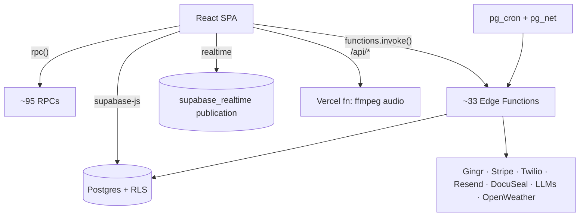

# Backend Architecture (Supabase + Vercel)

The backend is **Supabase** (Postgres + Auth + Realtime + Storage + Edge
Functions) plus **one Vercel serverless function**. Postgres is the source of
truth; the schema, RLS, and RPCs are defined in `supabase/migrations/`.

---

## 1. Source of truth: migrations

- `supabase/migrations/` — **~218 SQL files** (≈23 are CLI stub markers). They are
  the authoritative schema, RLS policies, RPCs, cron jobs, and realtime
  publications.
- Top‑level `supabase/*.sql` (e.g. `schema.sql`, `normalize-tables.sql`,
  `multi-location.sql`, `public-link-rpcs.sql`) are older/manual scripts kept for
  reference — **migrations win**.
- `supabase/config.toml` — `max_rows = 100000`, storage `file_size_limit = 500MiB`,
  MFA TOTP enabled, and per‑function `verify_jwt` settings (14 functions disable
  JWT verification because they're cron/service‑key callers or public webhooks).

### Domain coverage (selected)
Lite foundation (`lite_profiles`, `lite_settings`, `lite_daily_ops`), Gingr mirror
tables, RLS hardening (`get_my_lite_location_ids()` + SECURITY DEFINER helpers),
subscriptions, cash‑basis revenue, dashboard metrics, scheduling matrix + backfill,
labor/training (employees, templates, readiness boards, compliance, reviews),
interviews, facility presence, inventory, grassroots/marketing, resort upkeep,
Ignite CRM, incidents, enrichment/calendar/weather, and realtime publications.

## 2. Edge Functions (~33)

`supabase/functions/_shared/*` holds shared TS modules (scheduling‑matrix,
gingr‑auth, room‑occupancy, bathing/room‑cleaning logic) imported by the
deployable functions.

| Function | Purpose | Called from frontend? |
| --- | --- | --- |
| `ai-assistant` | LLM tool‑use assistant + Operations Manual KB | Yes (POS) |
| `gingr-sync` | Full/incremental Gingr → Supabase sync + presence | Yes (many) |
| `gingr-boh-poll` | Poll Gingr back‑of‑house | cron |
| `gingr-today-notes` | Today's Gingr service notes | Yes (CheckoutNotes) |
| `compute-scheduling-matrix` | Daily scheduling matrix (1 day/request) | Yes |
| `compute-rotation-schedule` | Staff rotation grid | Yes |
| `scheduling-matrix-backfill` | Historical matrix backfill | Yes |
| `scheduling-audit` | Scheduling vs Gingr audit | Yes |
| `ops-compute` / `ops-compute-ondemand` | Daily ops compute → `lite_daily_ops` | Yes (on‑demand) |
| `ops-platform-health` | Platform health audit | Yes (Dashboard/Home) |
| `ops-audit` / `ops-reports` / `ops-bathing-manual` / `ops-private-play-manual` | Ops audits & manual overrides | internal |
| `assign-rooms` / `get-room-assignments` | Room assignment model | internal |
| `breed-detect` / `breed-detect-bulk` / `breed-compare` | Photo breed/collar ID (OpenAI/Anthropic) | Yes (Photos, raw fetch) |
| `interview-transcribe-audio` / `interview-ai-draft` | Interview STT + drafting (xAI) | Yes (Labor) |
| `nlp-query` | Plain‑language analytics queries | (deployed) |
| `stripe-checkout` / `stripe-webhook` | Subscription billing | checkout: yes; webhook: Stripe |
| `send-otp` / `send-reminders` | Twilio SMS OTP + reminders | otp: yes; reminders: cron |
| `ignite-webhook` / `ignite-health-check` / `ignite-backfill` | Resend inbound leads + health | webhook/cron |
| `performance-review-signing` / `docuseal-webhook` | DocuSeal e‑sign | server/webhook |
| `weather-daily` | OpenWeather cache | Yes |

## 3. RPCs (≈95 called from the frontend)

The client calls `supabase.rpc("...")` for transactional domains so the server
owns invariants under RLS. Highlights by domain:

- **Auth/team:** `get_my_profile`, `claim_invitation`, `send_team_invite`,
  `manage_lite_team_member`.
- **Multi‑location/enterprise:** `list_locations`, `create_location`,
  `switch_location`, `get_locations_ops_data`, `list_enterprise_users`.
- **Booking/portal (public):** `get_public_booking_data`, `submit_online_booking`,
  `verify_otp_and_get_customer`, `get_public_link_data`, `sign_public_agreement`,
  `submit_public_questionnaire`.
- **Dashboards/snapshots:** `snapshot_live`, `dashboard_mobile_snapshot`,
  `workflow_progress_snapshot`, `facility_presence_snapshot`, `get_client_stats`.
- **Labor/training (largest surface):** `get_labor_dashboard_snapshot`,
  `get_labor_compliance_board`, `create_training_record`,
  `set_training_item_status`, `create_review_instance`,
  `complete_employee_review_instance`, `*_capacity_model_*`, …
- **Resort upkeep:** 19 `resort_upkeep_*` RPCs.
- **Grassroots:** `save_grassroots_target_with_event_dates`,
  `update_grassroots_activity_with_history`.

> The RPC contract currently lives only in SQL; the frontend discovers functions
> by string name. Generating typed RPC bindings is a recommended improvement.

## 4. Realtime

- Tables are explicitly added to the `supabase_realtime` publication via
  migrations (training, inventory, calendar, Ignite, resort upkeep, …); some
  tests assert this (`inventoryRealtime.test.js`).
- ~16 subscription sites. The POS `useData.js` historically reloaded the whole
  dataset on any of ~40 table changes; the egress work (PR #85) coalesces and
  visibility‑gates this via `src/shared/reloadScheduler.js`. Newer Lite pages
  already debounce (`Training` 150ms, `Inventory` 200ms, presence 2s).

## 5. Vercel serverless API (`api/`)

| File | Purpose | Served by |
| --- | --- | --- |
| `api/interview-normalize-audio.js` | FFmpeg transcode interview audio → STT‑ready chunks (too heavy for Deno edge) | `vercel.json` function (`maxDuration: 300`); dev via the Vite plugin in `vite.config.js` |
| `api/inbound-email.js` | (legacy) SendGrid inbound → `process_ignite_lead` | edge runtime; primary path is now Resend → `ignite-webhook` |

## 6. Frontend ↔ backend contract

- `src/supabaseClient.js` builds a single client from `VITE_SUPABASE_URL` /
  `VITE_SUPABASE_ANON_KEY` (anon key only; service role never reaches the
  browser).
- Data access patterns: (1) normalized hook (`useData.js`, POS), (2) RPC‑first
  domains (labor, upkeep, booking, enterprise), (3) edge functions for heavy
  compute, (4) Vercel API for FFmpeg.

## 7. Build & deploy

- **Build:** Vite 6 (`vite build`), esbuild minify, console/debugger dropped in
  prod, `target: es2020`, single bundle (`manualChunks: undefined` — code‑splitting
  is a recommended improvement).
- **Tests:** Vitest 4 (`environment: 'node'`); 63 files / 988 tests; a `prebuild`
  hook writes `public/test-results.json` for an in‑app Test Health page.
- **Deploy:** Vercel hosts the SPA + the one API function; Supabase hosts the DB +
  edge functions + `pg_cron`. Risky function deploys go through
  `scripts/deploy-risky-functions.mjs` with explicit `verifyJwt`.

## 8. Gaps

No CI workflow, no lint/format config, RPC signatures undocumented outside SQL,
dual Ignite intake paths, and ~23 stub migrations add archaeology noise.
