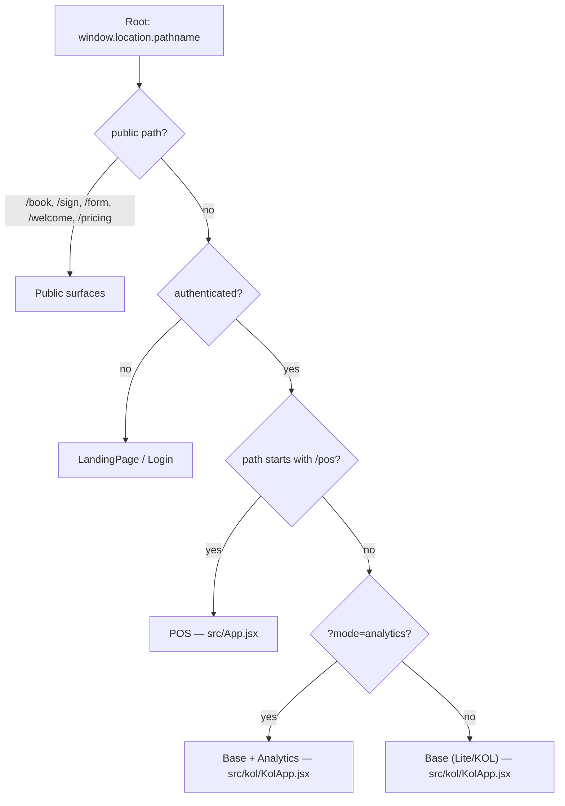

# Editions: K9 Operations vs. + Analytics vs. POS

K9 Operations ships as **one Vite bundle** that renders **three distinct
application editions** plus a set of public pages. The edition is decided **at
runtime** — there are no separate builds, feature packages, or deploy targets.

There are **two selection axes**:

1. **Path prefix** — `/pos*` → the legacy **POS** app; everything else
   (authenticated) → the **base "Lite/KOL"** app.
2. **Query flag** (base only) — `?mode=analytics` flips the same Lite shell into
   the **Analytics** edition (expanded navigation + financial/ops visibility).

The single dispatcher is `Root()` in [`src/main.jsx`](../../src/main.jsx).

---

## Quick comparison

| | **K9 Operations** (base) | **+ Analytics** | **POS** |
| --- | --- | --- | --- |
| Internal name | Lite / "KOL" | Lite + analytics mode | legacy POS |
| Entry component | `src/kol/KolApp.jsx` | `src/kol/KolApp.jsx` | `src/App.jsx` |
| Selected by | authenticated, not `/pos` | `…?mode=analytics` | path under `/pos/*` |
| URL example | `/cherry-hill/home` | `/cherry-hill/dashboard?mode=analytics` | `/pos/cherry-hill/lodging` |
| Internal router | `parseLiteUrl` / `buildLiteUrl` | same | `parseUrl` / `buildUrl` |
| Nav source | role‑based nav arrays | `ANALYTICS_NAV_ITEMS` | `locationNavSections` |
| Data layer | `src/hooks/*` (RPC‑first) | same | `src/useData.js` |
| Status | **active** (target architecture) | **active** (flag of base) | **legacy** (being decomposed) |

---

## Routing table (the source of truth)

From `Root()` in `src/main.jsx` (evaluated each render so refreshes work):

| Path pattern | Component | Auth? | Edition / surface |
| --- | --- | --- | --- |
| `/book`, `/book/{slug}` | `BookingPage` | No | Public (customer booking) |
| `/sign/{uuid}` | `PublicPage → AgreementSigningPage` | No | Public (e‑sign) |
| `/form/{uuid}` | `PublicPage → QuestionnairePage` | No | Public (intake) |
| `/welcome`, `/pricing` | `LandingPage` | No (always) | Public (marketing) |
| `/` | `LandingPage` (guest) / `LiteApp` (auth) | — | Public → Base |
| `/login`, `/signup` | `Login` (guest) / `LiteApp` (auth) | — | Public → Base |
| `/pos`, `/pos/*` | `App` | **Yes** | **POS** |
| any other path | `LiteApp` | **Yes** | **Base** (or **Analytics** with `?mode=analytics`) |

Notes / gotchas worth knowing:
- `/welcome` and `/pricing` are **unconditionally public** (they bypass auth even
  for signed‑in users), unlike `/` which sends authenticated users into Base.
- `/signup` renders the `Login` component — there is **no self‑serve signup UI**
  wired in (signup is invite‑driven).
- `isPublicRoadmap` (`/public-roadmap`) is **dead code** — declared but never used.

---

## Edition A — K9 Operations (base / Lite / KOL)

The default authenticated app and the **target architecture** for the product.

- **Entry:** `LiteApp` → `LeanAppInner` (in `src/kol/KolApp.jsx`), wrapped in a
  branded error boundary.
- **URL scheme:** root‑relative `/{locationSlug}/{pageSlug}` (the legacy `/lite`
  prefix is stripped for back‑compat). Examples: `/cherry-hill`,
  `/cherry-hill/operations`, `/enterprise/operations`,
  `/cherry-hill/client/{phone}`.
- **Navigation is role‑based.** `KolApp.jsx` chooses a nav array by the user's
  role, then filters each item through `canAccessLitePage()`:
  - `STAFF_NAV_ITEMS` — Home, My Work, Enrichments, Inventory, Photos, TV, Settings
  - `MANAGER_NAV_ITEMS` — adds CRM, Scheduling, Labor, Incidents, Resources,
    Marketing, Resort Upkeep, Cash Tips
  - `LEAN_NAV_ITEMS` (owner/admin) — Home, CRM, Calendar, Labor, Marketing,
    Inventory, Settings (other features launch from Home cards)
  - `LEAN_ENTERPRISE_NAV_ITEMS` — Volume, Attendance, Performance, Vendors,
    Licenses, Locations, User Management, Company Directory

➡️ Deep dive: **[app-base.md](app-base.md)**

---

## Edition B — K9 Operations + Analytics

**Not a separate app** — it is the base Lite shell with one flag flipped.

- **Selected by:** `IS_ANALYTICS_MODE = new URLSearchParams(location.search).get("mode") === "analytics"`
  in `src/kol/KolApp.jsx`.
- **Effect 1 — navigation:** when the flag is on, nav selection short‑circuits the
  role logic and returns **`ANALYTICS_NAV_ITEMS`**, the widest set: Home, CRM,
  **Dashboard**, **Customer Lifecycle**, **Ops Overview**, Scheduling,
  Enrichments, Labor, Incidents, Resources, Marketing, Resort Upkeep, Inventory,
  Cash Tips, Photos, TV, Settings.
- **Effect 2 — feature visibility:** pages read `analyticsMode` to widen what they
  show. For example `DashboardPage` unlocks financial and ops sections
  (`hasFinancial = analyticsMode || hasPermission("Financial Reporting")`, etc.);
  `HomePage` and `SettingsPage` also receive the flag.
- **URL examples:** `/cherry-hill/dashboard?mode=analytics`,
  `/cherry-hill/home?mode=analytics` (the flag affects nav/features globally, so
  any Lite page works).
- **Discoverability:** the location switcher exposes a demo entry
  *"K9 Operations + Analytics"* → `/cherry-hill/dashboard?mode=analytics`
  (owner/developer only).

> **Why a flag, not a separate edition?** Analytics is the *same* operational app
> with the reporting/intelligence surfaces turned up. Keeping it a flag avoids a
> code fork and lets a manager's base view and an owner's analytics view stay in
> lockstep.

➡️ Deep dive: **[app-analytics.md](app-analytics.md)**

---

## Edition C — K9 Operations POS (legacy)

The original point‑of‑sale app, served under `/pos/*`. It is the **legacy**
surface — feature work has moved to Base/Analytics — and is the larger of the two
god files currently being decomposed (`src/App.jsx`).

- **Entry:** `App` (default export of `src/App.jsx`), a monolithic shell with a
  `renderPage()` switch.
- **Selected by:** `path.startsWith('/pos')`.
- **URL scheme:** everything under `POS_BASE = "/pos"`, e.g.
  `/pos/cherry-hill/dashboard`, `/pos/cherry-hill/lodging`,
  `/pos/enterprise/locations`.
- **Navigation:** `locationNavSections` (Dashboard, Lodging Calendar, Online
  Bookings, Customer Lifecycle, Messages, Operations, Learning/LMS, AI Command,
  Settings, Reports) and `enterpriseNavSections`, gated by `NAV_PERM_MAP` +
  `hasPermission()`.
- **Edition switching:** the location switcher in either app cross‑navigates by
  full page load — Lite→POS sets `window.location.href = "/pos/" + slug`;
  POS→Lite sets `window.location.href = "/"`.

> Note: the POS sidebar still shows the label "Lite · KOL" — naming drift from the
> shared chrome; harmless but worth knowing.

➡️ Deep dive: **[app-pos.md](app-pos.md)**

---

## Public (unauthenticated) surfaces

These are shared by all editions and render **before** any auth check:

| Surface | File | Routes | Purpose |
| --- | --- | --- | --- |
| Marketing landing | `src/LandingPage.jsx` | `/`, `/welcome`, `/pricing` | K9Operations.com one‑pager + Sign In |
| Staff login | `src/Login.jsx` | `/login`, `/signup` | email/password sign‑in + forgot‑password |
| Online booking | `src/BookingPage.jsx` | `/book/{slug}` | customer self‑booking (OTP portal) |
| Agreement signing | `src/PublicPages.jsx` | `/sign/{id}` | public e‑signature |
| Questionnaire | `src/PublicPages.jsx` | `/form/{id}` | public intake form |

Public data flows through anonymous RPCs (`get_public_booking_data`,
`get_public_link_data`, `submit_online_booking`, `sign_public_agreement`, …)
guarded by RLS, never the service‑role key.

---

## How the editions map onto the file tree

| Edition | Root folder (target) | Shared deps |
| --- | --- | --- |
| Base + Analytics | `src/kol/` (+ `src/hooks/`) | `src/shared/`, `src/AuthProvider.jsx`, `supabaseClient.js` |
| POS | `src/pos/` (from `App.jsx`) | `src/shared/` (after theme convergence), auth |
| Public booking | `src/booking/` (from `BookingPage.jsx`) | `src/shared/bookingTheme.js`, `supabaseClient.js` |
| Public/marketing | `LandingPage.jsx`, `PublicPages.jsx`, `Login.jsx` | minimal |

See **[FILE_ORGANIZATION.md](FILE_ORGANIZATION.md)** for the full tree.
