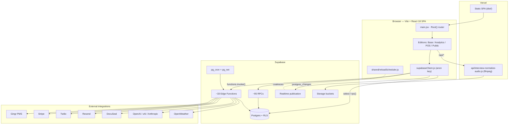
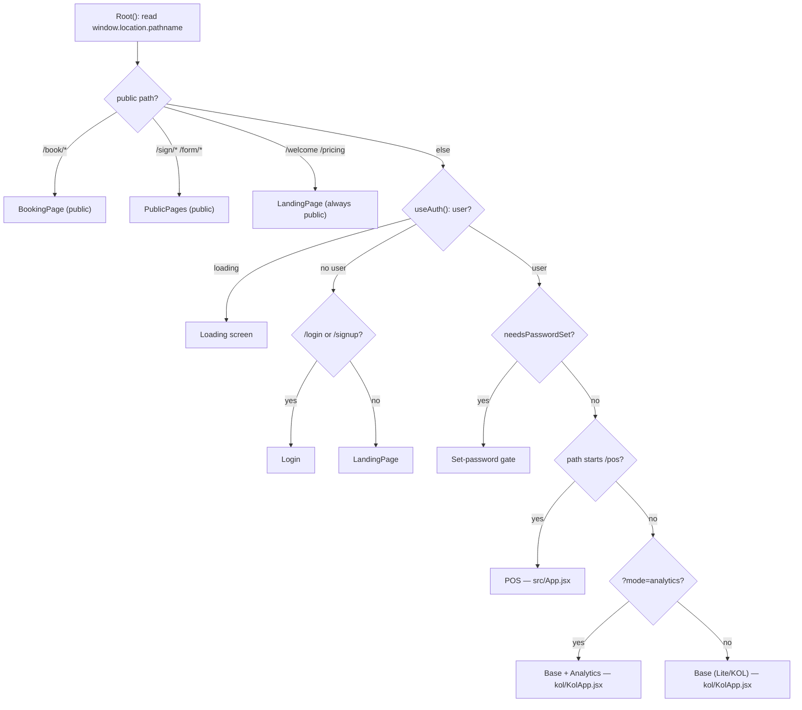
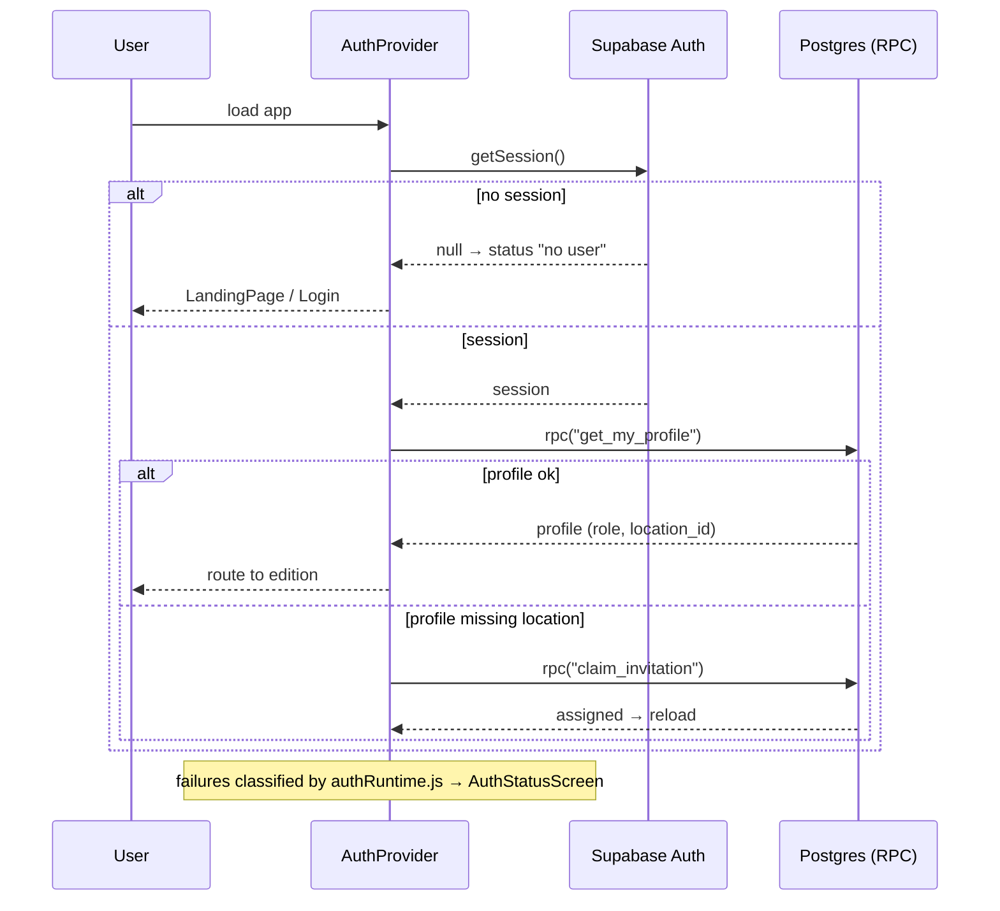
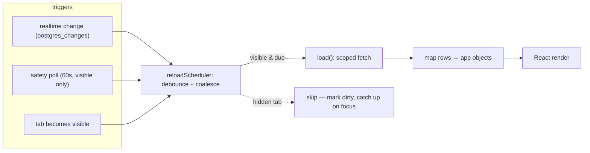
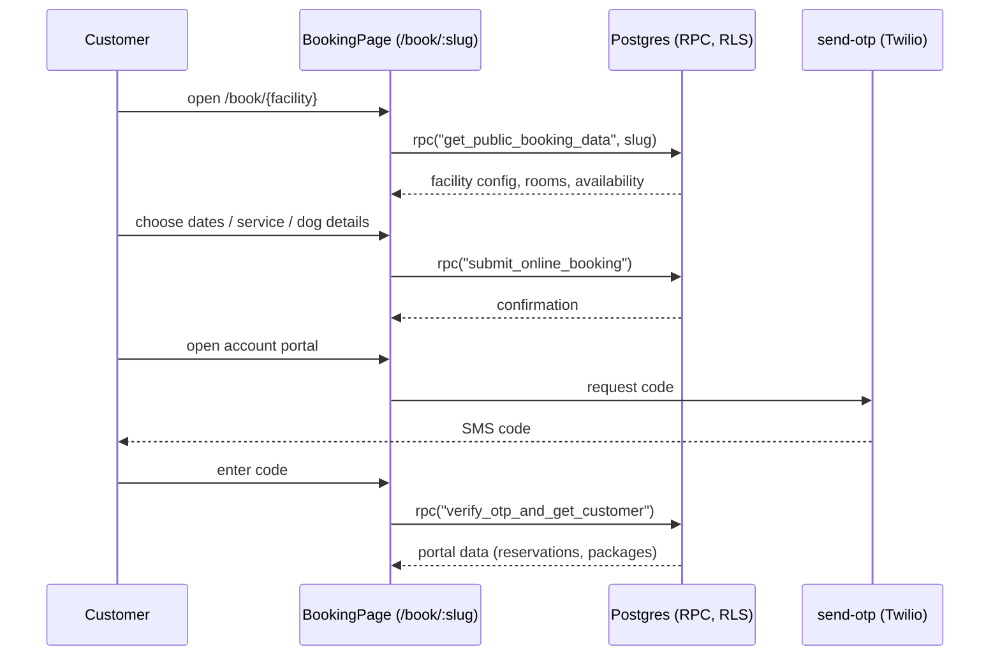
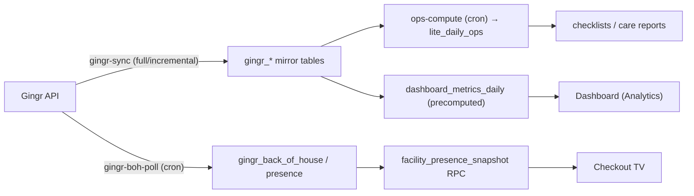
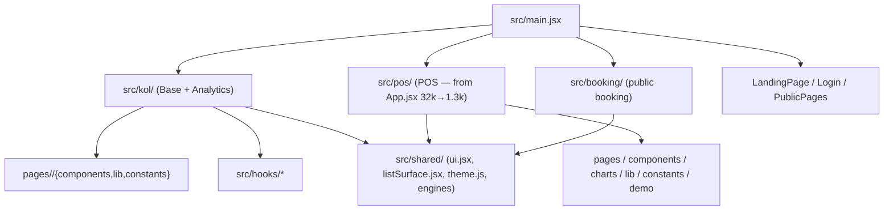
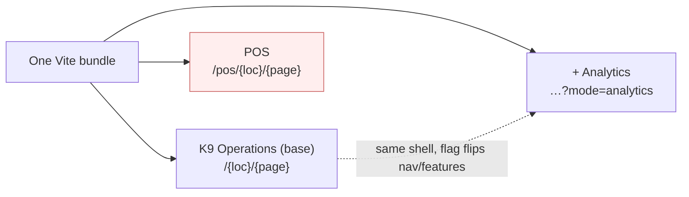

# Flowcharts & Diagrams

Visual companions to the architecture docs. All diagrams are **Mermaid** and render
natively on GitHub. For prose, see [ARCHITECTURE.md](../../ARCHITECTURE.md),
[EDITIONS.md](EDITIONS.md), and [BACKEND.md](BACKEND.md).

---

## 1. System architecture (deployment topology)

---

## 2. Edition selection — `Root()` decision flow

How one bundle resolves to one of three apps (+ public pages). Source:
`src/main.jsx`.

---

## 3. Auth bootstrap lifecycle

Source: `src/AuthProvider.jsx` + `src/authRuntime.js`.

---

## 4. Read path & egress‑aware refresh (the performance core)

Data is read via hooks/RPCs; refreshes (realtime + safety poll) are coalesced and
**visibility‑gated** so idle/background tabs stop re‑downloading. Source:
`src/useData.js`, `src/hooks/*`, `src/shared/reloadScheduler.js`.

> Before this design, the POS data layer re‑downloaded the whole location dataset on
> every change + a 30s always‑on poll (fixed in PR #85).

---

## 5. Public booking sequence (customer self‑service)

Source: `src/BookingPage.jsx` → anonymous RPCs (RLS‑guarded), `send-otp` edge fn.

---

## 6. Gingr sync pipeline (system of record → operational data)

Source: `gingr-sync`, `gingr-boh-poll` edge functions (cron‑driven).

---

## 7. Reorganized module structure (post‑decomposition)

The shape after the 24 move‑and‑relink PRs (see
[FILE_ORGANIZATION.md](FILE_ORGANIZATION.md)).

---

## 8. Editions at a glance

