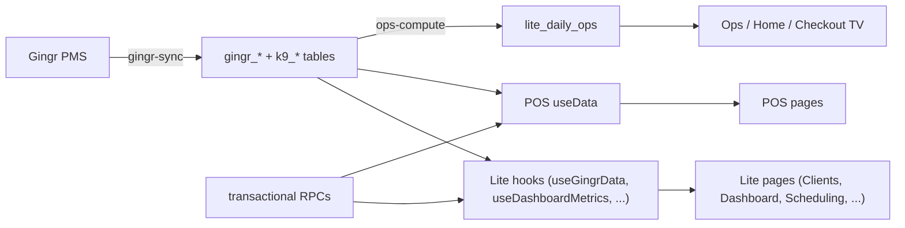

# Page Data Logic — what each screen shows and where the data comes from

A reference for **the logic behind the data on every major page**: what it renders,
its primary data source (a hook, an RPC, or an edge function), and whether it updates
in **realtime**. This is the "how it all connects" map between the UI and the
[backend](BACKEND.md).

**Three data‑access patterns** recur (see [ARCHITECTURE.md](../../ARCHITECTURE.md) §3–4):
- **Hook** — a `src/hooks/use*.js` module that fetches + caches (often phased loads,
  IndexedDB cache, column projection, stale‑while‑revalidate).
- **RPC** — `supabase.rpc("...")`; the server owns the query/transaction under RLS.
- **Edge fn** — `supabase.functions.invoke("...")` for heavy compute / integrations.

Realtime updates are coalesced + visibility‑gated by
[`reloadScheduler`](../../src/shared/reloadScheduler.js) (PR #85).

---

## Base + Analytics edition (`src/kol/`)

| Page | Renders | Primary data source | Realtime |
| --- | --- | --- | --- |
| **Home** (`HomePage`) | role‑aware shift summary / oversight, quick cards, platform health, weather | `rpc("dashboard_mobile_snapshot")`, `ops-platform-health` edge fn, weather hook | yes |
| **Dashboard** (`DashboardPage`) | revenue, occupancy, labor, ops KPIs, charts | `useDashboardMetrics` (precomputed `dashboard_metrics_daily`) + `rpc("snapshot_live")`; IndexedDB cache | poll + SWR |
| **Customer Lifecycle** (`ClientsPage`/`ClientDetailPage`) | lead/active/lapsed segmentation, profiles, history | `useGingrData` (clients/dogs/reservations) + `rpc("get_client_stats")` | yes |
| **CRM** (`CrmPage`) | Ignite / web‑form intake pipeline | `crmData.js` over Gingr + ignite tables | yes |
| **Funnel** (`FunnelPage`) | conversion funnel metrics | derived from lifecycle data | — |
| **Calendar** (`CalendarPage`) | aggregated multi‑source calendar | `rpc("get_calendar_events")` | yes |
| **Scheduling** (`SchedulingPage`) | staff schedule vs demand matrix, projections | `useSchedulingData` + `compute-scheduling-matrix` / `compute-rotation-schedule` / `scheduling-audit` edge fns | — |
| **Labor / Training** (`TrainingPage`) | roster, training records, compliance board, reviews | many `rpc("get_labor_*", "*_training_*", "*_review_*")` | yes |
| **Interviews** (`LaborInterviewsPage`) | interview workflow, PDF + AI draft | `rpc("get_labor_interview_records_redacted")`, `interview-ai-draft` / `interview-transcribe-audio` edge fns + `api/interview-normalize-audio` | — |
| **Attendance** (`AttendancePage`) | attendance tracker | `rpc("get_labor_roster_snapshot")` + `attendanceData.js` | yes |
| **Operations Hub / Daily Ops** (`OperationsHub`, `DailyOpsPage`, `RolePage`) | checklists (opening/closing, feeding/meds, room cleaning, bathing, play) | `useWorkflowProgressSnapshot` + `useRealtimeOps` over `lite_daily_ops`; `ops-compute-ondemand` edge fn; `shared/opsHelpers.js` | yes |
| **EOD** (`EODPage`) | end‑of‑day report form | `lite_daily_ops` + settings | yes |
| **Care Reports** (`CareReportsPage`) | feeding & medication reports | `ops-compute-ondemand` edge fn | — |
| **Inventory** (`InventoryPage`/`InventoryReportPage`) | count cycles, catalog, depletion | inventory tables + `inventory*.js` (catalog/depletion/status) | yes |
| **Enrichments** (`EnrichmentsPage`) | program calendar + workflow | `useEnrichmentEvents` / `useEnrichmentWorkflow` | yes |
| **Checkout TV** (`CheckoutTVPage`) | live lobby checkout board | `facility_presence_snapshot` RPC + BOH freshness (`checkoutTvFreshness.js`) | yes (2s‑throttled) |
| **Checkout Notes** (`CheckoutNotesPage`) | per‑dog checkout notes | `gingr-today-notes` edge fn | yes |
| **Photos** (`PhotosPage`) | photo grid, HEIC convert, breed pairing | Storage bucket + `breed-detect` edge fn | — |
| **Cash Tips** (`CashTipsPage`) | cash tips tracking | cash‑basis tables | — |
| **Grassroots / Marketing Directory** | outreach tracker, org/contact directory | `grassrootsData.js` / `marketingDirectoryData.js` + `rpc("save_grassroots_*")` | yes |
| **Resort Upkeep** (`ResortUpkeepPage`) | upkeep, vendors, licenses | 19 `rpc("resort_upkeep_*")` (`resortUpkeepData.js`) | yes |
| **Incidents** (`ClientManagementPage`) | incident log + rate inputs | `rpc("incident_rate_inputs")` | — |
| **Resources / Role Layout** | staff resources; checklist template editor | settings tables; `rpc("replace_role_page_config")` | — |
| **Settings** (`SettingsPage` + tabs) | Gingr/Ignite/rooms/permissions/weather config | per‑tab settings tables + `rpc("replace_gingr_workflow_mapping")` | — |

### Enterprise (multi‑location) views (`src/kol/enterprise/`)
| Page | Renders | Source |
| --- | --- | --- |
| **Enterprise Dashboard** | cross‑location rollups | `enterpriseAggregation.js` over `rpc("get_locations_ops_data")` |
| **Company Directory** | org chart + directory | `useEnterpriseDirectory` + `companyDirectoryModel.js` (Balkan org chart) |
| **User Management** | cross‑location users/roles | `rpc("list_enterprise_users", "manage_lite_team_member", ...)` |
| **Ops Matrix / Attendance / Locations** | multi‑site ops, attendance, location admin | aggregation RPCs |

---

## POS edition (`src/pos/`, served at `/pos/*`)

| Page | Renders | Source |
| --- | --- | --- |
| **Dashboard / Reports** | financial + ops analytics | `useData` (normalized V2 schema) + chart components |
| **Lodging Calendar** (`LodgingCalendarPage`) | reservation calendar, room assignments | `useData` reservations + `assign-rooms` / `get-room-assignments` |
| **Customer Lifecycle / Client Detail** | full client CRUD | `useData` clients/dogs |
| **New Reservation / Boarding Preview** | booking + check‑in/out preview, pricing | `useData` + `pos/lib/pricing.js` |
| **Payments / Messages** | payment + messaging | `useData` payments/messages |
| **Operations / EOD** | POS checklists | `useData` daily ops |
| **AI Command** (`AIAssistantPage`) | LLM assistant + **Operations Manual KB** | `ai-assistant` edge fn + local KB (PR #89) |
| **Online Bookings / Settings / LMS** | bookings admin, settings, learning | `useData` + `rpc("get_booking_drafts")` |

> POS's single data hook (`src/useData.js`) loads the normalized location dataset; the
> egress fix (PR #85) makes its realtime refresh coalesced + visibility‑gated.

---

## Public surfaces

| Surface | Renders | Source |
| --- | --- | --- |
| **Landing** (`LandingPage`) | K9Operations.com marketing one‑pager | static |
| **Login** (`Login`) | sign‑in / forgot password | Supabase Auth |
| **Booking** (`BookingPage`) | customer self‑booking + OTP portal | `rpc("get_public_booking_data", "submit_online_booking", "verify_otp_and_get_customer")`, `send-otp` |
| **Sign / Form** (`PublicPages`) | public e‑sign / intake | `rpc("get_public_link_data", "sign_public_agreement", "submit_public_questionnaire")` |

---

## How pages interconnect (the data spine)

The shared **source of truth is Gingr → mirror tables**; everything downstream is a
view, a precomputed metric, or a transactional RPC over that data. That's why the
editions stay consistent: they read the same spine through different lenses.
