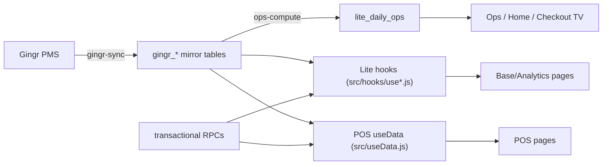

# Backend & Data

How data flows from the PMS into every screen. This is the quick reference; the full
inventory (every edge function, RPC, migration, realtime table) is in
[BACKEND.md](../architecture/BACKEND.md).

## The data spine

**Source of truth = Gingr → mirror tables.** Everything downstream is a view, a
precomputed metric, or a transactional RPC over that data. That's why the editions
stay consistent — they read the same spine through different lenses.

## Table groups (by domain)

| Prefix / table | Domain |
| --- | --- |
| `gingr_owners`, `gingr_animals`, `gingr_reservations`, `gingr_reservation_types`, `gingr_immunization_types`, `gingr_sync_state` | Gingr mirror (clients, pets, bookings) |
| `lite_clients`, `lite_client_lifecycle`, `ignite_leads` | lifecycle / CRM / lead capture |
| `lite_daily_ops`, `lite_checklist_templates` | daily operations & EOD |
| `labor_employees`, `training_records`, `employee_review_instances`, `labor_compliance_*`, `labor_position_hierarchy`, `labor_capacity_model*`, `daily_staff_plan` | labor / training / compliance |
| `scheduling_matrix_daily`, `rotation_schedules`, `scheduling_projection_snapshots` | scheduling |
| `enrichment_events`, `v_dog_playgroup_assignments_current` | enrichment & playgroups |
| `inventory_catalog`, `inventory_snapshots`, `inventory_counts` | inventory |
| `resort_upkeep_*` | facilities upkeep / vendors / licenses |
| `grassroots_*`, marketing directory tables | marketing |
| `enterprise_directory_*` (`*_safe` views) | enterprise directory / org chart |
| `dashboard_metrics_daily`, `weather_daily_cache` | precomputed metrics / weather |
| `lite_settings`, `lite_permissions`, `lite_profiles`, `lite_audit_log`, `locations`, `profile_locations`, `location_roles` | config / auth / audit |
| `location_*` (V2) | POS normalized schema |

## RPCs (~95)
Called via `supabase.rpc(...)`; the server owns the query/transaction under RLS.
Hot paths: `get_client_stats`, `dashboard_mobile_snapshot`, `snapshot_live`,
`get_calendar_events`, `get_labor_roster_snapshot`, `resort_upkeep_*` (~19),
`save_grassroots_*`, `claim_invitation`, `record_lite_app_activity`,
`get_public_booking_data` / `submit_online_booking` / `verify_otp_and_get_customer`.

## Edge functions (~33, Deno)
Heavy compute & integrations under `supabase/functions/`. Categories:
- **Sync:** `gingr-sync`, `gingr-boh-poll`, `gingr-today-notes`.
- **Compute:** `ops-compute(-ondemand)`, `compute-scheduling-matrix`, `compute-rotation-schedule`, `scheduling-matrix-backfill`, `assign-rooms`, `get-room-assignments`.
- **AI:** `ai-assistant`, `nlp-query`, `breed-detect(-bulk)`, `breed-compare`, `interview-ai-draft`, `interview-transcribe-audio`.
- **Integrations:** `stripe-checkout`/`stripe-webhook`, `send-otp`/`send-reminders`, `ignite-webhook`/`ignite-*`/`inbound-email`, `performance-review-signing`/`docuseal-webhook`, `weather-daily`.
- **Health/audit:** `ops-platform-health`, `ops-audit`, `scheduling-audit`, `ignite-health-check`.

Many are scheduled with `pg_cron` + `pg_net`.

## Client, caching & realtime
- **Client:** `src/supabaseClient.js` — the singleton `createClient`. Its `fetch` is
  wrapped to power [Demo Mode](Demo-Mode.md) (scrub reads / block writes); a transparent
  passthrough otherwise.
- **Caching / egress:** phased loads + IndexedDB cache (`useGingrData`), precomputed
  metrics (`dashboard_metrics_daily` + `shared/dashboardCache.js`), and a
  visibility‑aware, coalescing realtime/poll scheduler (`shared/reloadScheduler.js`).
- **Realtime:** tables are added to the `supabase_realtime` publication via migrations;
  hooks like `useRealtimeOps` subscribe to `postgres_changes`.

## Migrations
Schema, RLS, RPCs, and realtime config live in `supabase/migrations/` (~218 files) and
are the source of truth (they win over older top‑level `supabase/*.sql`).
