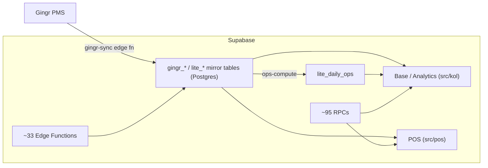

# K9 Operations — Engineering Wiki

> The operating system for pet‑care facilities. This wiki is the navigable guide to
> the codebase: what every screen does, how the backend powers it, and where the code
> lives. For narrative deep‑dives, it links out to [`ARCHITECTURE.md`](../../ARCHITECTURE.md)
> and [`docs/architecture/`](../architecture/).

K9 Operations layers a complete operations stack — daily checklists, customer
lifecycle/CRM, labor & training, scheduling, inventory, enrichment, and reporting —
on top of a facility's **Gingr** PMS, and ships as **three runtime editions from one
codebase**.



## Start here

| If you want to… | Read |
| --- | --- |
| Understand the system end‑to‑end | [`ARCHITECTURE.md`](../../ARCHITECTURE.md) |
| See the whole repo, every folder explained | **[Directory Structure](Directory-Structure.md)** |
| Learn what each **base‑platform** screen does + its backend + files | **[Base Platform Pages](Base-Platform-Pages.md)** |
| Same, for the **POS** edition | **[POS Pages](POS-Pages.md)** |
| Multi‑location (enterprise) views | **[Enterprise](Enterprise.md)** |
| Public/unauthenticated surfaces | **[Public Surfaces](Public-Surfaces.md)** |
| The data spine: tables, RPCs, edge functions, realtime | **[Backend & Data](Backend-and-Data.md)** ( + [BACKEND.md](../architecture/BACKEND.md) ) |
| How the read‑only, PII‑safe **Demo** account works | **[Demo Mode](Demo-Mode.md)** |
| Editions, auth, design system, flowcharts | [EDITIONS](../architecture/EDITIONS.md) · [app‑base](../architecture/app-base.md) · [app‑pos](../architecture/app-pos.md) · [DESIGN.md](../../DESIGN.md) · [FLOWCHARTS](../architecture/FLOWCHARTS.md) |

## The three editions (one bundle, three apps)

| Edition | URL signal | Entry component | Audience |
| --- | --- | --- | --- |
| **K9 Operations** (base / "Lite" / "KOL") | any authed path **not** under `/pos` | `src/kol/KolApp.jsx` | staff & managers |
| **+ Analytics** | base **+ `?mode=analytics`** | `src/kol/KolApp.jsx` (feature branch) | owners / operators |
| **POS** | `/pos/*` | `src/App.jsx` → `src/pos/` | front desk |
| *Public* | `/`, `/welcome`, `/pricing`, `/login`, `/book/*`, `/sign/*`, `/form/*` | `LandingPage`, `Login`, `BookingPage`, `PublicPages` | prospects & customers |

The edition is chosen **at runtime by URL** in `Root()` (`src/main.jsx`) — there is no
React Router and no separate builds.

## Tech stack

- **Frontend:** React 18 + Vite 6 (single‑page app, no router — manual path dispatch).
- **Backend:** Supabase — Postgres + RLS + Realtime + Storage + ~33 Edge Functions
  (Deno), ~95 RPCs, `pg_cron`/`pg_net` for schedules. Schema in
  `supabase/migrations/` (~218 files).
- **Hosting:** Vercel (static SPA + one serverless function for FFmpeg audio).
- **Integrations:** Gingr (PMS), Stripe, Twilio, Resend, DocuSeal, OpenAI/xAI/Anthropic,
  OpenWeather, Google Places, Highlight.io. See [ARCHITECTURE.md §5](../../ARCHITECTURE.md#5-external-integrations).
- **Testing:** Vitest (1000+ tests). `npm test`.

## Quickstart

```bash
# 1. Install
npm install

# 2. Configure env (Vite reads VITE_*). See .env.example for the full manifest.
#    Required to talk to a backend: VITE_SUPABASE_URL, VITE_SUPABASE_ANON_KEY

# 3. Develop / build / test
npm run dev        # Vite dev server
npm run build      # production build → dist/
npm test           # Vitest (vitest run)
npm run preview    # serve the production build
```

## How this wiki is organized

- **Reference pages** (`Base-Platform-Pages`, `POS-Pages`, `Enterprise`, `Public-Surfaces`)
  document **every screen** with a consistent template — **Purpose**, **Files &
  directory organization**, and **Backend functionality** (tables / RPCs / edge
  functions / hooks / realtime / permissions).
- **System pages** (`Directory-Structure`, `Backend-and-Data`, `Demo-Mode`) cover
  cross‑cutting concerns.
- **Deep dives** live in [`docs/architecture/`](../architecture/) and are linked from
  each page rather than duplicated here.
